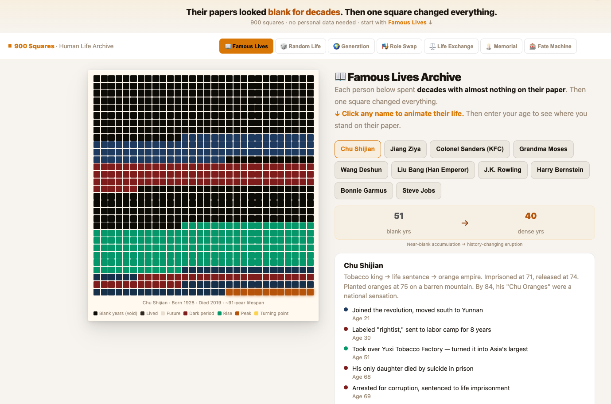

# 900 Squares Life Grid — Famous Lives Visualizer (Free Browser Tool)

**[🔴 Live Demo → ordinarymantrying.com/tools/life-paper/](https://ordinarymantrying.com/tools/life-paper/)**  
**[▶ Open on GitHub Pages →](https://daligao.github.io/life-paper/)**

A free, single-file life-in-months visualization tool. 75 years. 900 squares. Each square is one month of a human life. Watch famous lives animate on the grid — then see exactly where you stand on theirs.

**No sign-up. No install. No personal data required. Works in any browser.**

---

## What People Search For — and What This Answers

- *"life in weeks visualization"* → this shows months, not weeks — more granular, less overwhelming
- *"how many months do I have left"* → Golden Zone lens calculates time left with your parents
- *"famous people who succeeded late in life"* → Chu Shijian (started over at 74), Grandma Moses (painting at 78), Colonel Sanders (KFC at 62)
- *"mortality awareness tool"* → 7 lenses, none require entering your own birth date

---

## 7 Lenses to Explore

| Lens | What it shows |
|---|---|
| 📖 **Famous Lives** | Watch Chu Shijian, Grandma Moses, Colonel Sanders animate. Enter your age to see where you stand on their paper. |
| 🎲 **Random Life** | A stranger's paper, randomly assembled. You'll recognize yourself in it. |
| 🌍 **Generation** | The average paper for Post-80s, Post-90s, Post-00s. Are you ahead or behind? |
| 🎭 **Role Swap** | 8 roles — migrant worker, caregiver, artist, ICU nurse. Same grid, different story. |
| ⚖️ **Life Exchange** | Pick life "packages." The grid shows what you're actually trading. |
| 🕯️ **Collective Memorial** | What millions said about each square, sorted by age. |
| 🎰 **Fate Machine** | You didn't choose where you started. Neither did most people. |

---

## Bonus Features

- 💛 **Golden Zone** — calculate how many months you have left with your parents (enter their age)
- 🛡️ **Regret Shield** — 3 risk checks before it's too late
- 📚 Book recommendations: *4,000 Weeks*, *Die With Zero*, *Man's Search for Meaning*
- ☕ Ko-fi support button (appears after 3rd animation — only for engaged users)

---

## How It Differs From Similar Tools

| Tool | Approach |
|---|---|
| Tim Urban's "Your Life in Weeks" | Static image, your own life only |
| **This tool (life-paper)** | Animated, famous lives, 7 lenses, no personal data needed |
| [life-a4](https://ordinarymantrying.com/tools/life-a4/) | Personal grid — enter your birth month, seal wishes |
| [life-clock](https://github.com/daligao/life-clock) | Analytics — black holes, felt time, Life Density score |

---

## Technical

- Single HTML file — zero dependencies, zero build step
- Light/elegant theme, GPU-composited cell animations
- 900-cell DOM pool — created once, reused on every render (no GC pressure)
- Event delegation for tooltip handling
- `localStorage` for onboarding + Regret Shield state
- `@media print` support

---

## Part of the Life Trilogy

All three tools share the same 900-square grid metaphor — different angles on the same question.

→ [life-paper](https://ordinarymantrying.com/tools/life-paper/) · [life-a4](https://ordinarymantrying.com/tools/life-a4/) · [life-clock](https://ordinarymantrying.com/tools/life-clock/)

*Built as part of [Ordinary Man Trying](https://ordinarymantrying.com/) — a public experiment in building a blog and tool suite using AI, with zero prior tech background.*

---

## Transparency

Built by a non-technical Chinese parent using AI as a development partner — zero coding background. The tools, concepts, 7 lenses, Collective Memorial, Regret Shield — all human ideas. The AI wrote the code.

The companion blog post was drafted by AI based on my notes, and is [labeled as such](https://ordinarymantrying.com/famous-lives-900-square-grid-life-visualization/).

**Content labeling policy:** Blog posts where AI wrote the text for SEO purposes carry "(AI Generated)" in the title. Posts where the human author prepared the content and ideas do not carry that label. Featured images are optional for SEO posts. Building in public means being honest about the process. This is the process.
